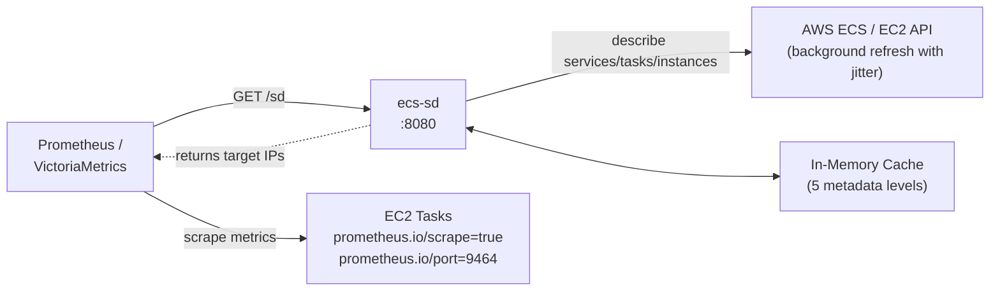
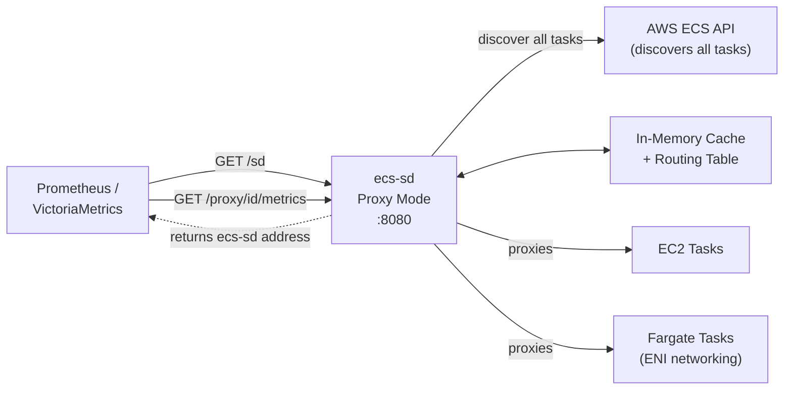
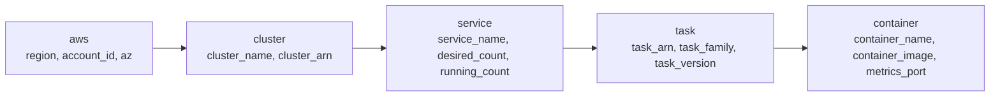
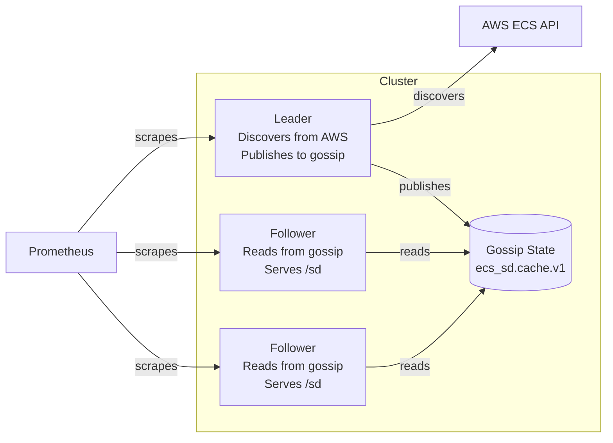
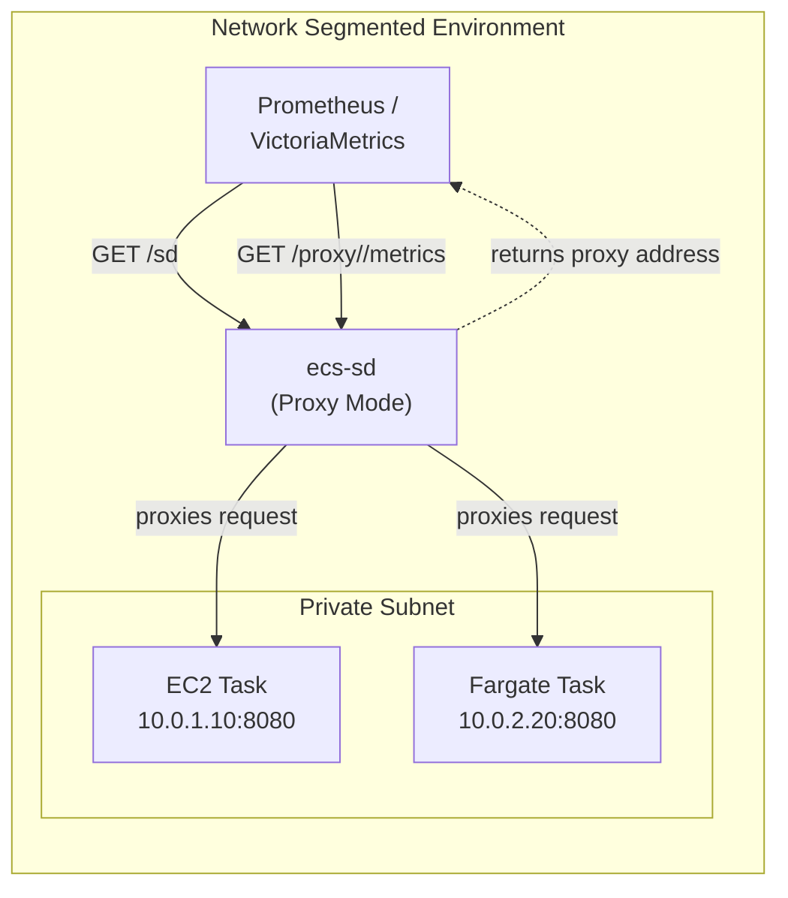
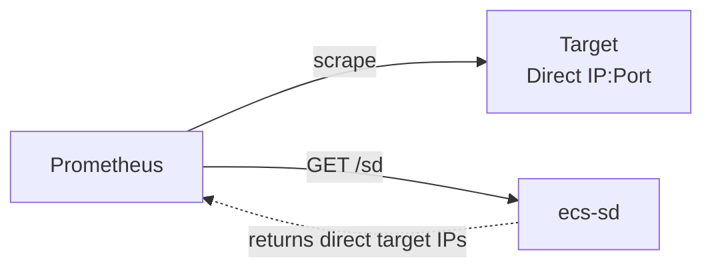
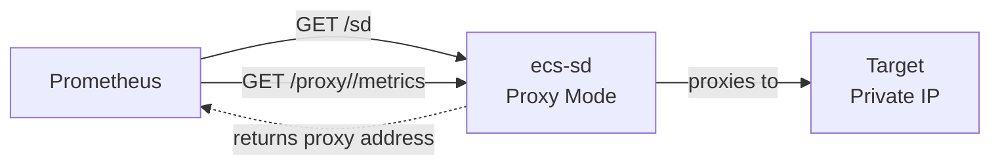
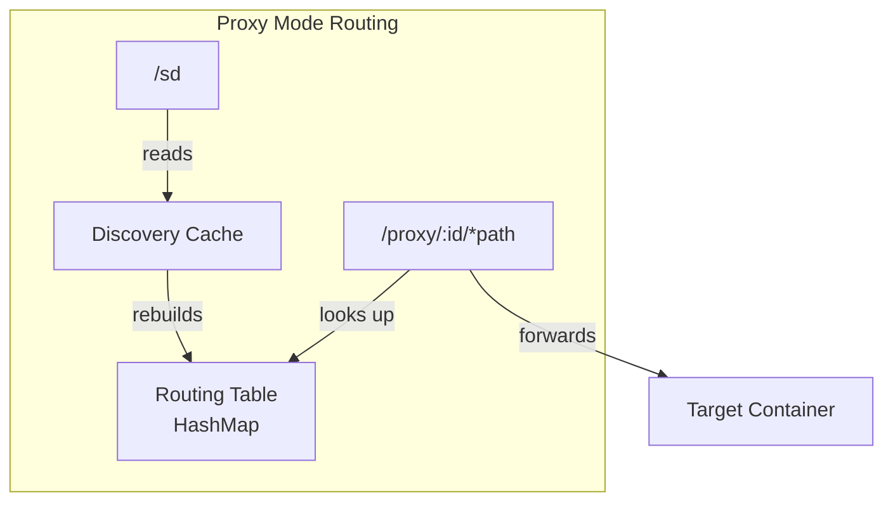
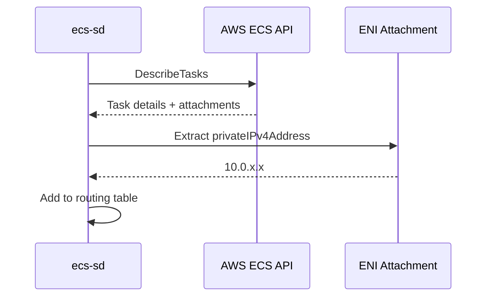
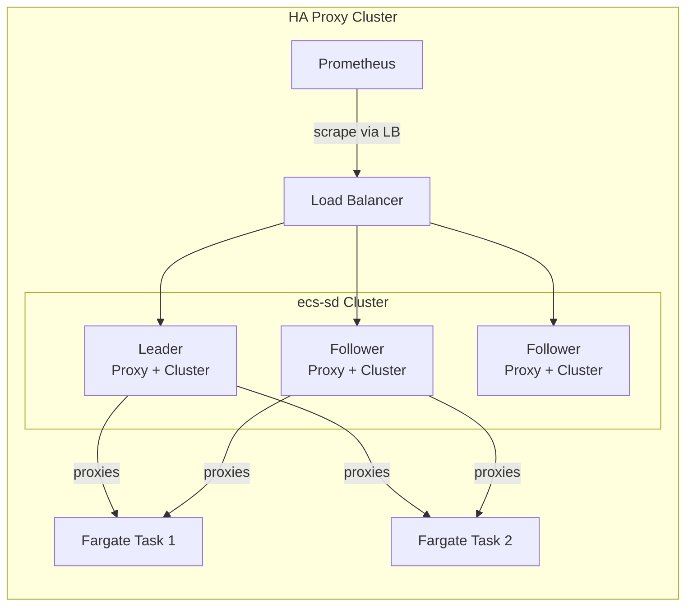

# ecs-sd

**Prometheus HTTP Service Discovery for AWS ECS** — automatically discover scrape targets for containers running on ECS (EC2 launch type) with zero manual configuration.

Drop it in, point Prometheus at it, and it finds every container with `prometheus.io/scrape=true` — caching results to keep AWS API costs low and serving them with stale-while-revalidate resilience.

---

## How It Works

ecs-sd runs in **two primary modes** — choose based on your infrastructure:

### Discovery Mode (EC2 Only)

The original mode for EC2 launch type where Prometheus scrapes targets directly:



**Best for:** EC2 launch type with direct network access from Prometheus to containers.

### Proxy Mode (Fargate + EC2)

Reverse proxy mode that enables Fargate support and network-segmented deployments:



**Best for:** Fargate launch type, network segmentation, or when direct container access is restricted.

---

On startup, `ecs-sd` crawls your ECS clusters — enumerating services, tasks, and task definitions — then resolves private IPs for every container carrying `prometheus.io/scrape=true` and `prometheus.io/port` labels. Results are cached in memory across 5 metadata levels and refreshed in the background with random jitter to avoid thundering herd.

Prometheus scrapers hit `/sd` — always served from cache, never block on AWS.

---

## Quick Start

### Discovery Mode (Default - EC2 Only)

For EC2 launch type where Prometheus has direct network access to containers:

```shell
docker run --rm -p 8080:8080 \
  -e AWS_REGION=eu-west-1 \
  -e AWS_ACCESS_KEY_ID=... \
  -e AWS_SECRET_ACCESS_KEY=... \
  -e ECS_SD_CLUSTERS=my-cluster,prod-cluster \
  ghcr.io/wasilak/ecs-sd
```

```yaml
# prometheus.yml
scrape_configs:
  - job_name: 'ecs-containers'
    http_sd_configs:
      - url: 'http://ecs-sd:8080/sd'
```

### Proxy Mode (Fargate + Network Segmentation)

For Fargate tasks or when Prometheus cannot directly reach container IPs:

```shell
docker run --rm -p 8080:8080 \
  -e AWS_REGION=eu-west-1 \
  -e AWS_ACCESS_KEY_ID=... \
  -e AWS_SECRET_ACCESS_KEY=... \
  -e ECS_SD_CLUSTERS=my-cluster \
  -e ECS_SD_MODE=proxy \
  -e ECS_SD_PUBLIC_ADDRESS=ecs-sd.example.com:8080 \
  ghcr.io/wasilak/ecs-sd
```

```yaml
# prometheus.yml - same configuration!
scrape_configs:
  - job_name: 'ecs-containers'
    http_sd_configs:
      - url: 'http://ecs-sd:8080/sd'
    # Prometheus automatically follows __metrics_path__ from /sd response
```

That's it. Prometheus discovers all ECS containers with metrics endpoints automatically — whether they're on EC2 or Fargate.

---

## Configuration

All options are CLI flags **and** environment variables.

### Core Options

| Flag | Env Var | Default | Description |
|---|---|---|---|
| `--clusters` | `ECS_SD_CLUSTERS` | — (required) | Comma-separated ECS cluster names or ARNs |
| `--listen` | `ECS_SD_LISTEN` | `0.0.0.0:8080` | Socket address to bind |
| `--refresh-interval` | `ECS_SD_REFRESH_INTERVAL` | `60s` | Background cache refresh interval |
| `--metadata-level` | `ECS_SD_METADATA_LEVEL` | `task` | Metadata detail level (container/task/service/cluster/aws) |

### Operating Mode

| Flag | Env Var | Default | Description |
|---|---|---|---|
| `--mode` | `ECS_SD_MODE` | `discovery` | Operating mode: `discovery` (direct targets) or `proxy` (reverse proxy for Fargate) |
| `--public-address` | `ECS_SD_PUBLIC_ADDRESS` | — | Reachable address for proxy mode (required when mode=proxy) |

### Cluster Mode (HA)

| Flag | Env Var | Default | Description |
|---|---|---|---|
| `--cluster-mode` | `ECS_SD_CLUSTER_MODE` | `standalone` | Cluster membership: `standalone` or `cluster` |
| `--cluster-seeds` | `ECS_SD_CLUSTER_SEEDS` | — | Comma-separated seed addresses for gossip (cluster mode only) |
| `--gossip-port` | `ECS_SD_GOSSIP_PORT` | `8081` | UDP port for gossip protocol (cluster mode only) |
| `--node-id` | `ECS_SD_NODE_ID` | `hostname:port` | Unique node identifier (auto-generated from HOSTNAME env var) |

### Metrics

| Flag | Env Var | Default | Description |
|---|---|---|---|
| `--metrics-port` | `ECS_SD_METRICS_PORT` | — | Optional separate port for `/metrics` endpoint (default: same as `--listen`) |

### Example Configurations

**Simple Discovery Mode:**

```shell
ecs-sd \
  --clusters prod,staging \
  --listen 0.0.0.0:9090 \
  --refresh-interval 120s \
  --metadata-level service
```

**Proxy Mode for Fargate:**

```shell
ecs-sd \
  --clusters my-cluster \
  --mode proxy \
  --public-address ecs-sd.example.com:8080 \
  --metadata-level task
```

**Cluster Mode (HA):**

```shell
ecs-sd \
  --clusters my-cluster \
  --cluster-mode cluster \
  --cluster-seeds "ecs-sd-2:8081,ecs-sd-3:8081" \
  --node-id "ecs-sd-1" \
  --gossip-port 8081
```

**Combined Proxy + Cluster + Separate Metrics Port:**

```shell
ecs-sd \
  --clusters my-cluster \
  --mode proxy \
  --public-address ecs-sd.example.com:8080 \
  --cluster-mode cluster \
  --cluster-seeds "ecs-sd-2:8081" \
  --metrics-port 9090
```

---

## API

### `GET /health`

```json
{ "status": "healthy" }
```

### `GET /sd`

Returns scrape targets in Prometheus `http_sd_configs` JSON format.

**Query parameters:**

| Param | Description |
|---|---|
| `level` | Override metadata level per-request (`container`, `task`, `service`, `cluster`, `aws`) |
| `cluster` | Filter targets by cluster name |
| `service` | Filter targets by ECS service name |
| `family` | Filter targets by task definition family |

**Response:**

```json
[
  {
    "targets": ["10.0.1.42:9464"],
    "labels": {
      "__meta_ecs_cluster_name": "prod",
      "__meta_ecs_service_name": "api-gateway",
      "__meta_ecs_task_family": "api-gateway",
      "__meta_ecs_task_version": "42",
      "__meta_ecs_container_name": "app",
      "__meta_ecs_container_image": "nginx:1.25",
      "__meta_ecs_metrics_port": "9464",
      "__meta_ecs_region": "eu-west-1",
      "__meta_ecs_account_id": "123456789012",
      "__meta_ecs_availability_zone": "eu-west-1a"
    }
  }
]
```

**Response headers:**

| Header | Description |
|---|---|
| `X-Cache-Age` | Age of cached data in seconds |
| `X-Cache-State` | `fresh` or `stale` (stale-while-revalidate) |

### `POST /sd/refresh`

Triggers an immediate full cache refresh. Returns updated targets.

### `GET /metrics`

Returns Prometheus-formatted metrics about ecs-sd's own operation:

```
# HELP ecs_sd_discovery_duration_seconds Discovery duration in seconds
# TYPE ecs_sd_discovery_duration_seconds histogram
ecs_sd_discovery_duration_seconds_bucket{le="0.01"} 1
ecs_sd_discovery_duration_seconds_bucket{le="0.02"} 1
...

# HELP ecs_sd_discovery_targets_total Total number of discovered targets
# TYPE ecs_sd_discovery_targets_total gauge
ecs_sd_discovery_targets_total 42

# HELP ecs_sd_cache_age_seconds Age of cache in seconds since last refresh
# TYPE ecs_sd_cache_age_seconds gauge
ecs_sd_cache_age_seconds 45

# HELP ecs_sd_cluster_nodes_total Total number of nodes in the cluster
# TYPE ecs_sd_cluster_nodes_total gauge
ecs_sd_cluster_nodes_total 3

# HELP ecs_sd_cluster_is_leader Whether this node is the leader
# TYPE ecs_sd_cluster_is_leader gauge
ecs_sd_cluster_is_leader 1
```

Available metrics include:
- **Discovery**: `ecs_sd_discovery_duration_seconds`, `ecs_sd_discovery_targets_total`, `ecs_sd_discovery_errors_total`
- **Cache**: `ecs_sd_cache_age_seconds`, `ecs_sd_cache_refreshes_total`
- **Proxy** (proxy mode only): `ecs_sd_proxy_requests_total`, `ecs_sd_proxy_duration_seconds`
- **Cluster** (cluster mode only): `ecs_sd_cluster_nodes_total`, `ecs_sd_cluster_is_leader`

---

## Metadata Level System

5 hierarchical levels, each including all levels below it:



Control the level with `--metadata-level` (default: `task`) or per-request with `?level=`.

### Label Reference

| Level | Label | Source |
|---|---|---|
| `container` | `__meta_ecs_container_name` | Task definition |
| `container` | `__meta_ecs_container_image` | Task definition |
| `container` | `__meta_ecs_metrics_port` | `prometheus.io/port` label |
| `task` | `__meta_ecs_task_arn` | DescribeTasks |
| `task` | `__meta_ecs_task_family` | Task definition |
| `task` | `__meta_ecs_task_version` | Task definition |
| `service` | `__meta_ecs_service_name` | ECS service name |
| `service` | `__meta_ecs_desired_count` | DescribeServices |
| `service` | `__meta_ecs_running_count` | DescribeServices |
| `cluster` | `__meta_ecs_cluster_name` | Cluster name |
| `cluster` | `__meta_ecs_cluster_arn` | Cluster ARN |
| `aws` | `__meta_ecs_region` | AWS region |
| `aws` | `__meta_ecs_account_id` | STS caller identity |
| `aws` | `__meta_ecs_availability_zone` | EC2 instance metadata |

---

## Container Discovery Criteria

A container is included as a scrape target **only if** its task definition has these Docker labels:

| Label | Value | Purpose |
|---|---|---|
| `prometheus.io/scrape` | `true` | Opt-in to discovery |
| `prometheus.io/port` | numeric port | Metrics endpoint port |

If these labels are absent, the container is silently skipped.

---

## Architecture & Design Decisions

**Three operating modes:** Discovery mode (EC2), Proxy mode (Fargate + EC2), and Cluster mode (HA). Choose based on your network topology and availability requirements.

**Stale-while-revalidate.** Cache is always served immediately. If the background refresh fails, stale data continues to serve — broken AWS API calls never break your metrics pipeline.

**Jittered refresh.** Refresh interval is randomized ±10% to prevent synchronized thundering herd when multiple `ecs-sd` instances restart simultaneously.

**Partial results.** If one cluster is unavailable, the remaining clusters still return targets. Errors are logged, not propagated.

**One target per task.** Only the first container with `prometheus.io/scrape=true` is included per task.

**Stale-while-revalidate.** Cache is always served immediately. If the background refresh fails, stale data continues to serve — broken AWS API calls never break your metrics pipeline.

**Jittered refresh.** Refresh interval is randomized ±10% to prevent synchronized thundering herd when multiple `ecs-sd` instances restart simultaneously.

**Partial results.** If one cluster is unavailable, the remaining clusters still return targets. Errors are logged, not propagated.

**One target per task.** Only the first container with `prometheus.io/scrape=true` is included per task.

**Cluster mode for HA.** Multiple ecs-sd instances can form a gossip-based cluster with automatic leader election. Leader runs discovery; followers serve from replicated cache.

---

## Cluster Mode (Horizontal Scaling)

ecs-sd can run as a cluster of nodes that share discovery state via gossip. In cluster mode, one node is elected leader (lowest lexicographic node_id) and performs AWS discovery; followers maintain a local cache copy synced from gossip. Any node can serve `/sd` requests — this enables HA deployments where multiple ecs-sd instances behind a load balancer continue serving targets even if the leader fails.

### Architecture



### Configuration

The cluster mode adds four new configuration options:

| Flag | Env Var | Default | Description |
|---|---|---|---|
| `--clusters` | `ECS_SD_CLUSTERS` | — (required) | Comma-separated ECS cluster names or ARNs |
| `--cluster-mode` | `ECS_SD_CLUSTER_MODE` | `standalone` | Run mode: `standalone` or `cluster` |
| `--cluster-seeds` | `ECS_SD_CLUSTER_SEEDS` | — | Comma-separated `host:gossip_port` seed addresses (cluster mode only) |
| `--gossip-port` | `ECS_SD_GOSSIP_PORT` | `8081` | UDP port for gossip protocol (cluster mode only) |
| `--listen` | `ECS_SD_LISTEN` | `0.0.0.0:8080` | Socket address to bind |
| `--metadata-level` | `ECS_SD_METADATA_LEVEL` | `task` | Metadata detail level (see below) |
| `--node-id` | `ECS_SD_NODE_ID` | `hostname:port` | Unique node identifier (auto-generated if not set) |
| `--refresh-interval` | `ECS_SD_REFRESH_INTERVAL` | `60s` | Background cache refresh interval |

### Standalone vs Cluster

| Aspect | Standalone | Cluster |
|---|---|---|
| Use case | Single instance, simple deployments | HA requirements, load-balanced setups |
| Discovery | Every node polls AWS | Leader only polls AWS |
| Network overhead | None | UDP gossip on port 8081 |
| Failover | N/A | Automatic leader election on failure |
| AWS API calls | Per-instance | Once per cluster (leader) |

### Local Cluster Testing

```yaml
# docker-compose.cluster.yml
# Three-node ecs-sd cluster for local testing
# Each node can serve /sd requests; only the leader discovers from AWS
# Usage: docker-compose -f docker-compose.cluster.yml up
version: '3.8'
services:
  ecs-sd-1:
    image: ghcr.io/wasilak/ecs-sd
    environment:
      ECS_SD_CLUSTERS: my-cluster
      ECS_SD_CLUSTER_MODE: cluster
      ECS_SD_CLUSTER_SEEDS: ecs-sd-2:8081,ecs-sd-3:8081
      ECS_SD_NODE_ID: node-1
      ECS_SD_GOSSIP_PORT: "8081"
      # ... AWS credentials
    ports:
      - "8080:8080"

  ecs-sd-2:
    image: ghcr.io/wasilak/ecs-sd
    environment:
      ECS_SD_CLUSTERS: my-cluster
      ECS_SD_CLUSTER_MODE: cluster
      ECS_SD_CLUSTER_SEEDS: ecs-sd-1:8081,ecs-sd-3:8081
      ECS_SD_NODE_ID: node-2
      ECS_SD_GOSSIP_PORT: "8081"
      # ... AWS credentials
    ports:
      - "8081:8080"

  ecs-sd-3:
    image: ghcr.io/wasilak/ecs-sd
    environment:
      ECS_SD_CLUSTERS: my-cluster
      ECS_SD_CLUSTER_MODE: cluster
      ECS_SD_CLUSTER_SEEDS: ecs-sd-1:8081,ecs-sd-2:8081
      ECS_SD_NODE_ID: node-3
      ECS_SD_GOSSIP_PORT: "8081"
      # ... AWS credentials
    ports:
      - "8082:8080"
```

Run: `docker-compose -f docker-compose.cluster.yml up`

### Fargate Deployment

In Fargate `awsvpc` mode, each task has its own ENI — all tasks can use the same gossip port (8081) without conflict.

**Seed configuration:** Since Fargate tasks get dynamic IPs, you must:
1. Use AWS Cloud Map or Route 53 for DNS-based service discovery, OR
2. Supply seed IPs via the `ECS_SD_CLUSTER_SEEDS` environment variable updated at task startup

**Security Group:** Allow inbound UDP port 8081 from the security group itself (self-referencing rule).

---

## Proxy Mode (Fargate Support)

Proxy mode enables ecs-sd to work with **Fargate tasks** and provides a solution for network-segmented environments where Prometheus cannot directly reach container IPs.

### How Proxy Mode Works

In proxy mode, ecs-sd acts as a reverse proxy for discovered targets:



### Architecture Comparison

**Discovery Mode (v0.1.0 behavior):**


**Proxy Mode (v0.2.0):**


### Why Proxy Mode?

| Scenario | Discovery Mode | Proxy Mode |
|----------|---------------|------------|
| **Fargate tasks** | ❌ Cannot access private ENI IPs | ✅ Proxies through ecs-sd |
| **Network segmentation** | ❌ Requires direct routability | ✅ Single point of access |
| **Security isolation** | ❌ All targets exposed | ✅ Controlled via ecs-sd |
| **EC2 tasks** | ✅ Direct scrape works | ✅ Works via proxy |

### Configuration

Enable proxy mode with the `--mode` flag:

| Flag | Env Var | Default | Description |
|------|---------|---------|-------------|
| `--mode` | `ECS_SD_MODE` | `discovery` | Operating mode: `discovery` or `proxy` |
| `--public-address` | `ECS_SD_PUBLIC_ADDRESS` | — (required in proxy mode) | Reachable address of this ecs-sd instance for scrapers |

**Example - Proxy Mode:**

```shell
docker run --rm -p 8080:8080 \
  -e AWS_REGION=eu-west-1 \
  -e ECS_SD_CLUSTERS=my-cluster \
  -e ECS_SD_MODE=proxy \
  -e ECS_SD_PUBLIC_ADDRESS=ecs-sd.mycompany.com:8080 \
  ghcr.io/wasilak/ecs-sd
```

```yaml
# prometheus.yml
scrape_configs:
  - job_name: 'ecs-containers'
    http_sd_configs:
      - url: 'http://ecs-sd:8080/sd'
    # Prometheus automatically uses __metrics_path__ from /sd response
```

### Routing & Endpoints

In proxy mode, ecs-sd maintains an in-memory routing table mapping task IDs to target addresses:



**API Endpoints in Proxy Mode:**

| Endpoint | Description |
|----------|-------------|
| `GET /sd` | Returns targets with `__metrics_path__` pointing to `/proxy/<id>/metrics` |
| `GET /proxy/:id/metrics` | Proxies request to actual target's metrics endpoint |
| `GET /proxy/:id/*path` | Proxies arbitrary paths to target (for custom metrics paths) |

### Self-Exclusion (PROX-07)

ecs-sd automatically excludes itself from the routing table to prevent proxy loops. If ecs-sd runs as an ECS task with `prometheus.io/scrape=true`, it will appear in `/sd` output (for self-monitoring) but cannot be accessed via `/proxy` routes.

### Fargate Task Discovery

In proxy mode, Fargate tasks are discovered via their ENI (Elastic Network Interface) attachments:



Fargate tasks are identified by `launchType == "FARGATE"` and their private IPs are extracted from `attachments[].details[]` where `name == "privateIPv4Address"`.

### Combining Proxy + Cluster Modes

Proxy mode and cluster mode can be combined for **HA Fargate deployments**:



**Configuration:**

```yaml
# docker-compose.yml for HA Proxy Cluster
services:
  ecs-sd-1:
    image: ghcr.io/wasilak/ecs-sd
    environment:
      ECS_SD_CLUSTERS: my-cluster
      ECS_SD_MODE: proxy
      ECS_SD_PUBLIC_ADDRESS: ecs-sd-lb:8080
      ECS_SD_CLUSTER_MODE: cluster
      ECS_SD_CLUSTER_SEEDS: ecs-sd-2:8081,ecs-sd-3:8081
      ECS_SD_NODE_ID: node-1
```

---

## Building from Source

```shell
git clone git@github.com:wasilak/ecs-sd.git
cd ecs-sd

# Build release binary
cargo build --release

# Run
./target/release/ecs-sd --clusters my-cluster
```

Requires Rust 2024 edition (1.85+).

---

## AWS IAM Permissions

### Discovery Mode (EC2)

```json
{
  "Version": "2012-10-17",
  "Statement": [
    {
      "Effect": "Allow",
      "Action": [
        "ecs:ListClusters",
        "ecs:DescribeClusters",
        "ecs:ListServices",
        "ecs:DescribeServices",
        "ecs:ListTasks",
        "ecs:DescribeTasks",
        "ecs:DescribeTaskDefinition",
        "ec2:DescribeInstances",
        "ec2:DescribeContainerInstances",
        "sts:GetCallerIdentity"
      ],
      "Resource": "*"
    }
  ]
}
```

### Proxy Mode (Fargate + EC2)

Additional permission needed to extract Fargate task ENI information:

```json
{
  "Version": "2012-10-17",
  "Statement": [
    {
      "Effect": "Allow",
      "Action": [
        "ecs:ListClusters",
        "ecs:DescribeClusters",
        "ecs:ListServices",
        "ecs:DescribeServices",
        "ecs:ListTasks",
        "ecs:DescribeTasks",
        "ecs:DescribeTaskDefinition",
        "ec2:DescribeInstances",
        "ec2:DescribeContainerInstances",
        "ec2:DescribeNetworkInterfaces",
        "sts:GetCallerIdentity"
      ],
      "Resource": "*"
    }
  ]
}
```

**Note:** `ec2:DescribeNetworkInterfaces` is required for Fargate task discovery to extract private IPs from ENI attachments.

---

## License

MIT
