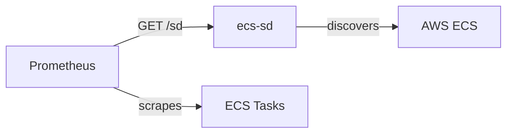
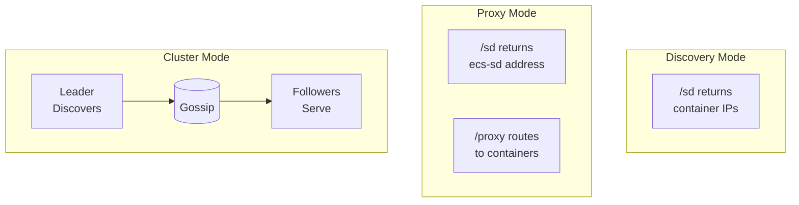

# ecs-sd

**Prometheus HTTP Service Discovery for AWS ECS**

Automatically discover and expose scrape targets for ECS containers with `prometheus.io/scrape=true`. Supports EC2 and Fargate launch types, with optional high-availability clustering.



## Features

- **Zero-config discovery** — Finds containers with Docker labels `prometheus.io/scrape=true` and `prometheus.io/port`
- **EC2 & Fargate support** — Direct targets for EC2, proxy mode for Fargate
- **High availability** — Gossip-based clustering with automatic leader election
- **Prometheus native** — Returns `http_sd_configs` compatible JSON
- **5 metadata levels** — From container to AWS account context
- **Stale-while-revalidate** — Always serves cached data, refreshes in background

## Quick Start

### Discovery Mode (EC2)

```bash
docker run -p 8080:8080 \
  -e ECS_SD_CLUSTERS=my-cluster \
  -e AWS_REGION=eu-west-1 \
  ghcr.io/wasilak/ecs-sd
```

### Proxy Mode (Fargate)

```bash
docker run -p 8080:8080 \
  -e ECS_SD_CLUSTERS=my-cluster \
  -e ECS_SD_MODE=proxy \
  -e ECS_SD_PUBLIC_ADDRESS=https://ecs-sd.example.com \
  -e AWS_REGION=eu-west-1 \
  ghcr.io/wasilak/ecs-sd
```

### Prometheus Configuration

```yaml
scrape_configs:
  - job_name: 'ecs'
    http_sd_configs:
      - url: 'http://ecs-sd:8080/sd'
```

That's it — Prometheus automatically discovers all ECS containers with metrics endpoints.

## Documentation

| Document | Description |
|----------|-------------|
| [Configuration Reference](docs/configuration.md) | All CLI flags and environment variables |
| [Proxy Mode](docs/proxy-mode.md) | Fargate support and reverse proxy mode |
| [Cluster Mode](docs/cluster-mode.md) | HA clustering with automatic failover |
| [API Reference](docs/api.md) | HTTP endpoints and response formats |
| [Self-Registration](docs/self-registration.md) | Monitoring ecs-sd itself |
| [Operational Runbook](docs/ops-runbook.md) | Production operations and troubleshooting |

## Container Discovery

Containers are discovered when their task definition includes these Docker labels:

| Label | Value | Purpose |
|-------|-------|---------|
| `prometheus.io/scrape` | `true` | Opt-in to discovery |
| `prometheus.io/port` | numeric | Metrics endpoint port |

Example task definition:

```json
{
  "containerDefinitions": [{
    "dockerLabels": {
      "prometheus.io/scrape": "true",
      "prometheus.io/port": "8080"
    }
  }]
}
```

## Architecture

### Operating Modes

**Discovery Mode** (default) — EC2 launch type:
- Returns direct container IPs to Prometheus
- Best when Prometheus has network access to containers

**Proxy Mode** — Fargate or network segmentation:
- Acts as reverse proxy for metrics scraping
- Required for Fargate (private ENI IPs)

**Cluster Mode** — High availability:
- Multiple ecs-sd instances form a cluster
- One leader discovers from AWS; followers serve from cache
- Automatic failover in ~15 seconds



## Configuration

Essential options:

| Flag | Env Var | Default | Description |
|------|---------|---------|-------------|
| `--clusters` | `ECS_SD_CLUSTERS` | required | ECS clusters to discover |
| `--listen` | `ECS_SD_LISTEN` | `:8080` | HTTP bind address |
| `--mode` | `ECS_SD_MODE` | `discovery` | `discovery` or `proxy` |
| `--public-address` | `ECS_SD_PUBLIC_ADDRESS` | — | Required for proxy mode |
| `--cluster-mode` | `ECS_SD_CLUSTER_MODE` | `standalone` | `standalone` or `cluster` |

See [Configuration Reference](docs/configuration.md) for all options.

## API

| Endpoint | Description |
|----------|-------------|
| `GET /health` | Health check |
| `GET /sd` | Service discovery targets |
| `POST /sd/refresh` | Trigger cache refresh |
| `GET /proxy/:id/metrics` | Proxy to target (proxy mode) |
| `GET /metrics` | Prometheus metrics |

See [API Reference](docs/api.md) for details.

## AWS IAM

Required permissions:

```json
{
  "Version": "2012-10-17",
  "Statement": [{
    "Effect": "Allow",
    "Action": [
      "ecs:ListClusters",
      "ecs:DescribeClusters",
      "ecs:ListServices",
      "ecs:DescribeServices",
      "ecs:ListTasks",
      "ecs:DescribeTasks",
      "ecs:DescribeTaskDefinition",
      "ec2:DescribeInstances",
      "ec2:DescribeContainerInstances",
      "ec2:DescribeNetworkInterfaces",
      "sts:GetCallerIdentity"
    ],
    "Resource": "*"
  }]
}
```

## Deployment

### Docker Compose

```yaml
version: '3.8'
services:
  ecs-sd:
    image: ghcr.io/wasilak/ecs-sd
    environment:
      ECS_SD_CLUSTERS: production
      ECS_SD_REFRESH_INTERVAL: 60s
    ports:
      - "8080:8080"
```

### ECS Fargate with Terraform

See [terraform/modules/ecs-sd-cluster](terraform/modules/ecs-sd-cluster/) for production-ready infrastructure including:
- Cloud Map service discovery
- Auto-scaling
- Security groups
- IAM roles

## Building

```bash
git clone https://github.com/wasilak/ecs-sd.git
cd ecs-sd
cargo build --release
```

Requires Rust 1.85+ (2024 edition).

## License

GNU General Public License v3.0 — see [LICENSE](LICENSE)
