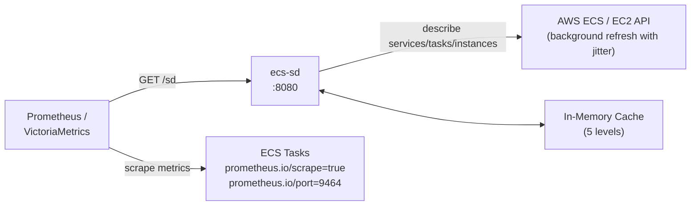
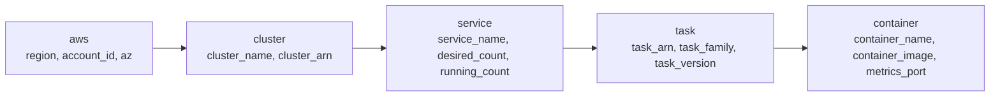

# ecs-sd

**Prometheus HTTP Service Discovery for AWS ECS** — automatically discover scrape targets for containers running on ECS (EC2 launch type) with zero manual configuration.

Drop it in, point Prometheus at it, and it finds every container with `prometheus.io/scrape=true` — caching results to keep AWS API costs low and serving them with stale-while-revalidate resilience.

---

## How It Works



On startup, `ecs-sd` crawls your ECS clusters — enumerating services, tasks, and task definitions — then resolves EC2 private IPs for every container carrying `prometheus.io/scrape=true` and `prometheus.io/port` labels. Results are cached in memory across 5 metadata levels and refreshed in the background with random jitter to avoid thundering herd.

Prometheus scrapers hit `/sd` — always served from cache, never block on AWS.

---

## Quick Start

```shell
docker run --rm -p 8080:8080 \
  -e AWS_REGION=eu-west-1 \
  -e AWS_ACCESS_KEY_ID=... \
  -e AWS_SECRET_ACCESS_KEY=... \
  -e ECS_SD_CLUSTERS=my-cluster,prod-cluster \
  ghcr.io/wasilak/ecs-sd
```

```yaml
# prometheus.yml
scrape_configs:
  - job_name: 'ecs-containers'
    http_sd_configs:
      - url: 'http://ecs-sd:8080/sd'
```

That's it. Prometheus discovers all ECS containers with metrics endpoints automatically.

---

## Configuration

All options are CLI flags **and** environment variables.

| Flag | Env Var | Default | Description |
|---|---|---|---|
| `--clusters` | `ECS_SD_CLUSTERS` | — (required) | Comma-separated ECS cluster names or ARNs |
| `--listen` | `ECS_SD_LISTEN` | `0.0.0.0:8080` | Socket address to bind |
| `--refresh-interval` | `ECS_SD_REFRESH_INTERVAL` | `60s` | Background cache refresh interval |
| `--metadata-level` | `ECS_SD_METADATA_LEVEL` | `task` | Metadata detail level (see below) |

Example with all options:

```shell
ecs-sd \
  --clusters prod,staging \
  --listen 0.0.0.0:9090 \
  --refresh-interval 120s \
  --metadata-level service
```

---

## API

### `GET /health`

```json
{ "status": "healthy" }
```

### `GET /sd`

Returns scrape targets in Prometheus `http_sd_configs` JSON format.

**Query parameters:**

| Param | Description |
|---|---|
| `level` | Override metadata level per-request (`container`, `task`, `service`, `cluster`, `aws`) |
| `cluster` | Filter targets by cluster name |
| `service` | Filter targets by ECS service name |
| `family` | Filter targets by task definition family |

**Response:**

```json
[
  {
    "targets": ["10.0.1.42:9464"],
    "labels": {
      "__meta_ecs_cluster_name": "prod",
      "__meta_ecs_service_name": "api-gateway",
      "__meta_ecs_task_family": "api-gateway",
      "__meta_ecs_task_version": "42",
      "__meta_ecs_container_name": "app",
      "__meta_ecs_container_image": "nginx:1.25",
      "__meta_ecs_metrics_port": "9464",
      "__meta_ecs_region": "eu-west-1",
      "__meta_ecs_account_id": "123456789012",
      "__meta_ecs_availability_zone": "eu-west-1a"
    }
  }
]
```

**Response headers:**

| Header | Description |
|---|---|
| `X-Cache-Age` | Age of cached data in seconds |
| `X-Cache-State` | `fresh` or `stale` (stale-while-revalidate) |

### `POST /sd/refresh`

Triggers an immediate full cache refresh. Returns updated targets.

---

## Metadata Level System

5 hierarchical levels, each including all levels below it:



Control the level with `--metadata-level` (default: `task`) or per-request with `?level=`.

### Label Reference

| Level | Label | Source |
|---|---|---|
| `container` | `__meta_ecs_container_name` | Task definition |
| `container` | `__meta_ecs_container_image` | Task definition |
| `container` | `__meta_ecs_metrics_port` | `prometheus.io/port` label |
| `task` | `__meta_ecs_task_arn` | DescribeTasks |
| `task` | `__meta_ecs_task_family` | Task definition |
| `task` | `__meta_ecs_task_version` | Task definition |
| `service` | `__meta_ecs_service_name` | ECS service name |
| `service` | `__meta_ecs_desired_count` | DescribeServices |
| `service` | `__meta_ecs_running_count` | DescribeServices |
| `cluster` | `__meta_ecs_cluster_name` | Cluster name |
| `cluster` | `__meta_ecs_cluster_arn` | Cluster ARN |
| `aws` | `__meta_ecs_region` | AWS region |
| `aws` | `__meta_ecs_account_id` | STS caller identity |
| `aws` | `__meta_ecs_availability_zone` | EC2 instance metadata |

---

## Container Discovery Criteria

A container is included as a scrape target **only if** its task definition has these Docker labels:

| Label | Value | Purpose |
|---|---|---|
| `prometheus.io/scrape` | `true` | Opt-in to discovery |
| `prometheus.io/port` | numeric port | Metrics endpoint port |

If these labels are absent, the container is silently skipped.

---

## Architecture & Design Decisions

**EC2 only (no Fargate).** Containers on Fargate tasks use ENI networking with no directly routable EC2 instance IP. Contributions welcome for dual-stack support.

**Stale-while-revalidate.** Cache is always served immediately. If the background refresh fails, stale data continues to serve — broken AWS API calls never break your metrics pipeline.

**Jittered refresh.** Refresh interval is randomized ±10% to prevent synchronized thundering herd when multiple `ecs-sd` instances restart simultaneously.

**Partial results.** If one cluster is unavailable, the remaining clusters still return targets. Errors are logged, not propagated.

**One target per task.** Only the first container with `prometheus.io/scrape=true` is included per task.

---

## Building from Source

```shell
git clone git@github.com:wasilak/ecs-sd.git
cd ecs-sd

# Build release binary
cargo build --release

# Run
./target/release/ecs-sd --clusters my-cluster
```

Requires Rust 2024 edition (1.85+).

---

## AWS IAM Permissions

```json
{
  "Version": "2012-10-17",
  "Statement": [
    {
      "Effect": "Allow",
      "Action": [
        "ecs:ListClusters",
        "ecs:DescribeClusters",
        "ecs:ListServices",
        "ecs:DescribeServices",
        "ecs:ListTasks",
        "ecs:DescribeTasks",
        "ecs:DescribeTaskDefinition",
        "ec2:DescribeInstances",
        "ec2:DescribeContainerInstances",
        "sts:GetCallerIdentity"
      ],
      "Resource": "*"
    }
  ]
}
```

---

## License

MIT
