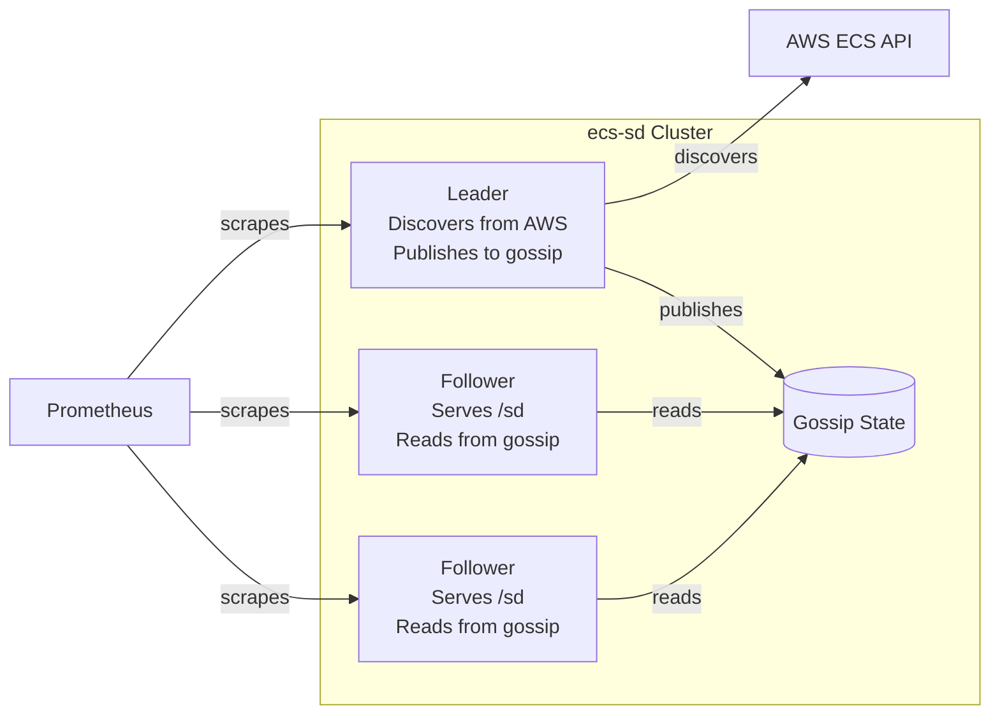
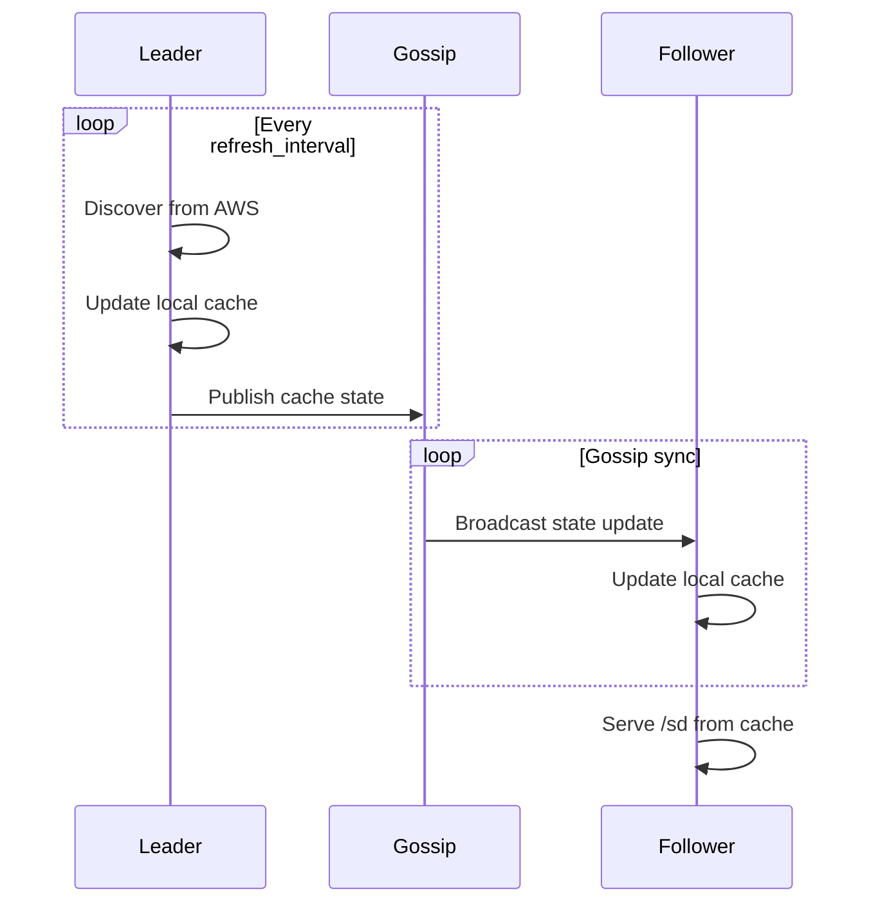
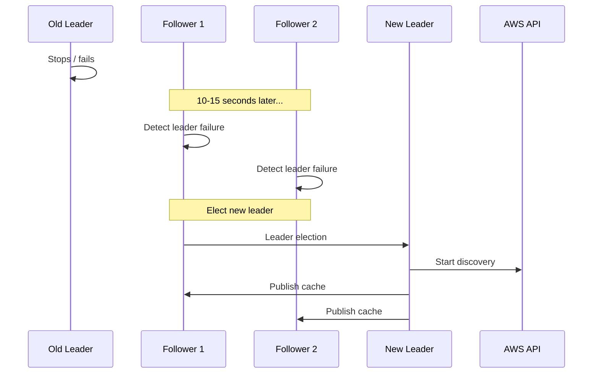

# Cluster Mode

Cluster mode enables multiple ecs-sd instances to form a high-availability cluster with shared discovery state and automatic leader election.

## Overview

In cluster mode:
- One node is elected **leader** and performs AWS discovery
- **Followers** receive cache updates via gossip protocol
- Any node can serve `/sd` requests
- Leader failover is automatic



## Why Use Cluster Mode?

| Aspect | Standalone | Cluster |
|--------|-----------|---------|
| **Availability** | Single point of failure | HA with automatic failover |
| **AWS API calls** | Per-instance | Once per cluster (leader only) |
| **Scalability** | Vertical only | Horizontal scaling |
| **Use case** | Single instance, dev/test | Production, critical workloads |

## Architecture

### Gossip Protocol

ecs-sd uses the [chitchat](https://github.com/quickwit-oss/chitchat) gossip protocol for cluster membership and state propagation:

- **UDP-based**: Lightweight, fast failure detection
- **Epidemic broadcast**: Efficient state propagation
- **Failure detection**: ~10-15 seconds to detect node failure

### Leader Election

Leader is determined by **lexicographically smallest node ID**:

```rust
// Pseudocode
fn elect_leader(nodes: &[Node]) -> Node {
    nodes.iter()
        .filter(|n| n.is_alive())
        .min_by_key(|n| n.node_id)
        .unwrap()
}
```

**Example:**
- Node IDs: `["ecs-sd-1", "ecs-sd-2", "ecs-sd-3"]`
- Leader: `"ecs-sd-1"` (lexicographically smallest)

### State Propagation



## Configuration

Enable cluster mode:

| Flag | Env Var | Default | Description |
|------|---------|---------|-------------|
| `--cluster-mode` | `ECS_SD_CLUSTER_MODE` | `standalone` | Set to `cluster` |
| `--cluster-seeds` | `ECS_SD_CLUSTER_SEEDS` | — | Seed addresses for join |
| `--gossip-port` | `ECS_SD_GOSSIP_PORT` | `8081` | UDP gossip port |
| `--node-id` | `ECS_SD_NODE_ID` | `hostname:port` | Unique node ID |

### Example: 3-Node Cluster

```yaml
# Node 1 (becomes leader if node-1 is lexicographically smallest)
environment:
  ECS_SD_CLUSTERS: production
  ECS_SD_CLUSTER_MODE: cluster
  ECS_SD_CLUSTER_SEEDS: "ecs-sd-2:8081,ecs-sd-3:8081"
  ECS_SD_NODE_ID: "ecs-sd-1"
  ECS_SD_GOSSIP_PORT: "8081"

# Node 2
environment:
  ECS_SD_CLUSTERS: production
  ECS_SD_CLUSTER_MODE: cluster
  ECS_SD_CLUSTER_SEEDS: "ecs-sd-1:8081,ecs-sd-3:8081"
  ECS_SD_NODE_ID: "ecs-sd-2"
  ECS_SD_GOSSIP_PORT: "8081"

# Node 3
environment:
  ECS_SD_CLUSTERS: production
  ECS_SD_CLUSTER_MODE: cluster
  ECS_SD_CLUSTER_SEEDS: "ecs-sd-1:8081,ecs-sd-2:8081"
  ECS_SD_NODE_ID: "ecs-sd-3"
  ECS_SD_GOSSIP_PORT: "8081"
```

## Deployment

### Docker Compose

```yaml
version: '3.8'
services:
  ecs-sd-1:
    image: ghcr.io/wasilak/ecs-sd
    environment:
      ECS_SD_CLUSTERS: production
      ECS_SD_CLUSTER_MODE: cluster
      ECS_SD_CLUSTER_SEEDS: "ecs-sd-2:8081,ecs-sd-3:8081"
      ECS_SD_NODE_ID: "node-1"
      ECS_SD_GOSSIP_PORT: "8081"
    ports:
      - "8080:8080"
      - "8081:8081/udp"

  ecs-sd-2:
    image: ghcr.io/wasilak/ecs-sd
    environment:
      ECS_SD_CLUSTERS: production
      ECS_SD_CLUSTER_MODE: cluster
      ECS_SD_CLUSTER_SEEDS: "ecs-sd-1:8081,ecs-sd-3:8081"
      ECS_SD_NODE_ID: "node-2"
      ECS_SD_GOSSIP_PORT: "8081"
    ports:
      - "8081:8080"
      - "8082:8081/udp"

  ecs-sd-3:
    image: ghcr.io/wasilak/ecs-sd
    environment:
      ECS_SD_CLUSTERS: production
      ECS_SD_CLUSTER_MODE: cluster
      ECS_SD_CLUSTER_SEEDS: "ecs-sd-1:8081,ecs-sd-2:8081"
      ECS_SD_NODE_ID: "node-3"
      ECS_SD_GOSSIP_PORT: "8081"
    ports:
      - "8082:8080"
      - "8083:8081/udp"
```

### AWS ECS Fargate

For production-ready Fargate deployment, configure:
- Cloud Map service discovery for seed addresses
- Auto-scaling
- Security group configuration
- IAM roles

**Key Fargate considerations:**
- Each task gets its own ENI — can use same gossip port
- Use Cloud Map DNS for dynamic seed discovery
- Security group needs self-referencing UDP 8081 rule

## Leader Failover

### Automatic Failover Process

When the leader fails:

1. **T+0s**: Leader stops (task failure, network partition, etc.)
2. **T+10-15s**: Followers detect failure via gossip
3. **T+15s**: New leader elected (smallest remaining node ID)
4. **T+20-30s**: New leader performs first discovery
5. **T+60s+**: Normal operation resumes



### Monitoring Failover

**Check leader identity:**
```bash
aws logs filter-log-events \
  --log-group-name /ecs/ecs-sd-cluster \
  --filter-pattern '"Performing initial discovery"' \
  --limit 1
```

**Expected log sequence:**
```
[old leader] Performing initial discovery... (stops)
[new leader] Performing initial discovery... (within 15 seconds)
```

## Network Requirements

### Security Group Rules

**Required for cluster mode:**

| Direction | Protocol | Port | Source | Description |
|-----------|----------|------|--------|-------------|
| Ingress | UDP | 8081 | Self SG | Gossip protocol |
| Egress | UDP | 8081 | Self SG | Gossip protocol |
| Ingress | TCP | 8080 | LB/Clients | HTTP API |
| Egress | TCP | 443 | 0.0.0.0/0 | AWS API |

**Self-referencing security group rule (AWS CLI):**
```bash
aws ec2 authorize-security-group-ingress \
  --group-id sg-xxxxxxxxx \
  --protocol udp \
  --port 8081 \
  --source-group sg-xxxxxxxxx
```

### Port Usage

| Port | Protocol | Purpose |
|------|----------|---------|
| 8080 | TCP | HTTP API (`/sd`, `/health`, `/metrics`) |
| 8081 | UDP | Gossip protocol (cluster membership) |

## Combining with Proxy Mode

For **HA Fargate deployments**, combine cluster + proxy modes:

```yaml
services:
  ecs-sd-1:
    image: ghcr.io/wasilak/ecs-sd
    environment:
      ECS_SD_CLUSTERS: production
      ECS_SD_MODE: proxy
      ECS_SD_PUBLIC_ADDRESS: https://ecs-sd-lb.example.com
      ECS_SD_CLUSTER_MODE: cluster
      ECS_SD_CLUSTER_SEEDS: "ecs-sd-2:8081,ecs-sd-3:8081"
      ECS_SD_NODE_ID: "node-1"
      ECS_SD_GOSSIP_PORT: "8081"
    ports:
      - "8080:8080"
      - "8081:8081/udp"
```

**Benefits:**
- HA proxy for Fargate tasks
- Load balancer can distribute across all nodes
- Automatic failover if any node fails
- Consistent routing table via gossip

## Troubleshooting

### Nodes Not Joining Cluster

**Check 1: Security Group**
```bash
aws ec2 describe-security-groups \
  --group-ids sg-xxxxxxxxx \
  --query 'SecurityGroups[0].IpPermissions[]'
```

Must include UDP 8081 with `UserIdGroupPairs`.

**Check 2: Seeds Configuration**
```bash
# Verify seeds resolve
nslookup ecs-sd-2.local
```

**Check 3: Gossip Port Open**
```bash
# From inside container
nc -vu ecs-sd-2 8081
```

### Multiple Leaders (Split-Brain)

**Detection:**
```sql
-- CloudWatch Logs Insights
fields @timestamp, @logStream
| filter @message like /Performing initial discovery/
| stats count() by @logStream, bin(1m)
```

If multiple tasks log "initial discovery" for >30 seconds, split-brain detected.

**Resolution:**
1. Check network connectivity between nodes
2. Verify security group rules
3. Force redeploy if persists:
   ```bash
   aws ecs update-service \
     --cluster production \
     --service ecs-sd-cluster \
     --force-new-deployment
   ```

### Cache Not Syncing

**Check gossip state:**
```bash
aws logs filter-log-events \
  --log-group-name /ecs/ecs-sd-cluster \
  --filter-pattern '"ecs_sd.cache.v1"' \
  --limit 20
```

Should see cache key being published by leader.

## Scaling

### Horizontal Scaling

Scale by adjusting desired count:

```bash
aws ecs update-service \
  --cluster production \
  --service ecs-sd-cluster \
  --desired-count 5
```

**New nodes:**
1. Join via seeds
2. Receive current cache via gossip
3. Start serving `/sd` requests
4. Participate in leader election (if applicable)

**Recommendations:**
- Minimum: 2 nodes (for HA)
- Production: 3+ nodes
- Maximum: Test with your workload

### Vertical Scaling

ecs-sd is not CPU/memory intensive. Scale vertically if:
- Large number of targets (>10,000)
- High request rate to `/metrics`
- Many concurrent proxy connections

## Monitoring

### Cluster Health Metrics

From `/metrics` endpoint:

```
# Number of nodes in cluster
ecs_sd_cluster_nodes_total 3

# Whether this node is leader (1=yes, 0=no)
ecs_sd_cluster_is_leader 1

# Discovery metrics (leader only)
ecs_sd_discovery_duration_seconds
ecs_sd_discovery_targets_total
ecs_sd_discovery_errors_total
```

### CloudWatch Alarms

**No healthy nodes:**
```bash
aws cloudwatch put-metric-alarm \
  --alarm-name ecs-sd-zero-healthy \
  --metric-name HealthyInstanceCount \
  --namespace AWS/ServiceDiscovery \
  --threshold 0 \
  --comparison-operator LessThanOrEqualToThreshold
```

**No discovery (leader down):**
```sql
-- Logs Insights scheduled query
fields @timestamp
| filter @message like /discovery refresh complete/
| stats count() as discovery_count
| filter discovery_count = 0
```

## See Also

- [Configuration Reference](configuration.md) - All configuration options
- [Proxy Mode](proxy-mode.md) - Fargate support
- [Self-Registration](self-registration.md) - Monitoring ecs-sd
- [Operational Runbook](ops-runbook.md) - Production operations
