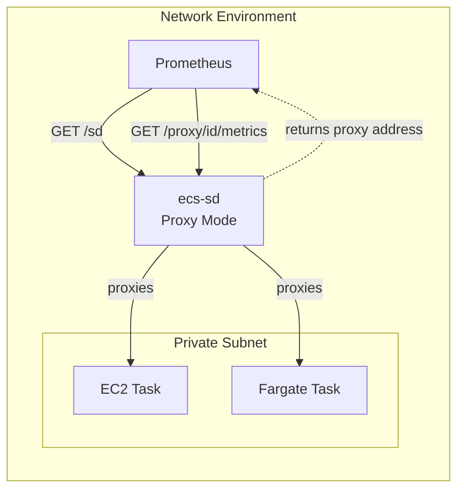
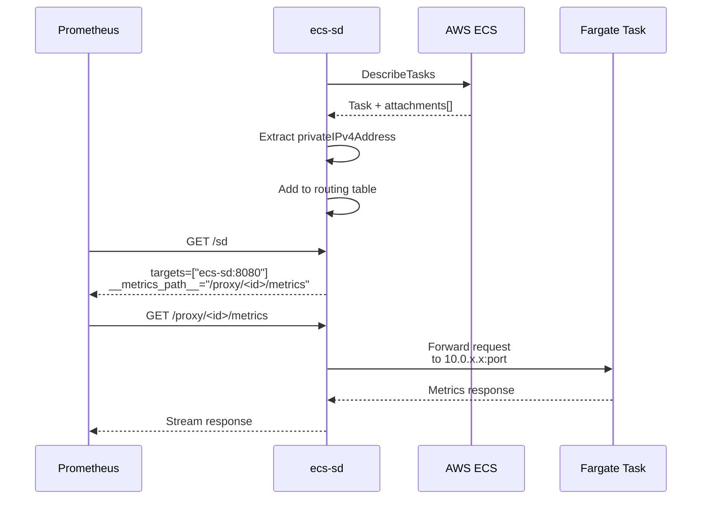
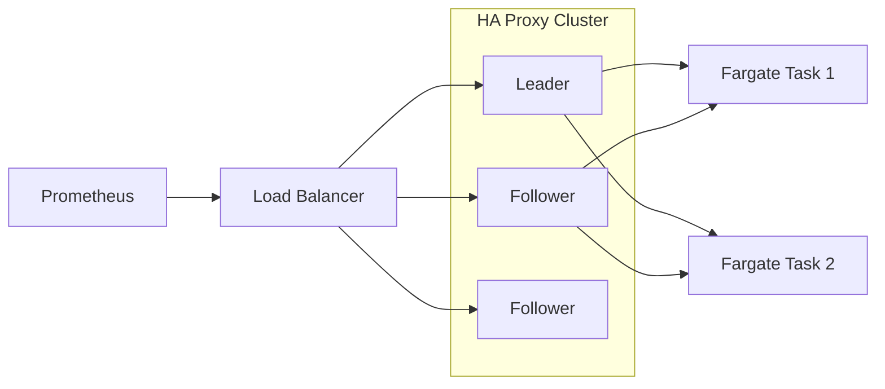

# Proxy Mode

Proxy mode enables ecs-sd to work with **Fargate tasks** and provides a solution for network-segmented environments where Prometheus cannot directly reach container IPs.

## Overview

In proxy mode, ecs-sd acts as a reverse proxy for discovered targets. Instead of returning direct container IPs, `/sd` returns ecs-sd's own address with a `__metrics_path__` that routes through ecs-sd to the actual target.



## Why Use Proxy Mode?

| Scenario | Discovery Mode | Proxy Mode |
|----------|---------------|------------|
| **Fargate tasks** | ❌ Private ENI IPs not routable | ✅ Proxies through ecs-sd |
| **Network segmentation** | ❌ Requires direct routability | ✅ Single access point |
| **Security isolation** | ❌ All targets exposed | ✅ Controlled via ecs-sd |
| **EC2 tasks** | ✅ Direct scrape works | ✅ Works via proxy |

## How It Works

### 1. Discovery

ecs-sd discovers all tasks (EC2 and Fargate) normally via AWS APIs.

### 2. Routing Table

For each discovered target, ecs-sd creates a routing entry:

```rust
// Simplified representation
routing_table: HashMap<UUID, Target> {
    "a1b2c3d4-e5f6-..." => Target {
        ip: "10.0.1.42",
        port: 8080,
        // ... other metadata
    }
}
```

The UUID is deterministically generated from task ARN (UUID v5), so it's consistent across all ecs-sd instances.

### 3. /sd Response

Instead of returning container IPs, `/sd` returns:

```json
[
  {
    "targets": ["ecs-sd.example.com:8080"],
    "labels": {
      "__metrics_path__": "/proxy/a1b2c3d4-e5f6-7890-abcd-ef1234567890/metrics",
      "__meta_ecs_cluster_name": "prod",
      "__meta_ecs_service_name": "api-gateway",
      "__meta_ecs_task_family": "api-gateway",
      "__meta_ecs_container_name": "app",
      "__meta_ecs_container_image": "nginx:1.25"
    }
  }
]
```

### 4. Proxy Request

When Prometheus scrapes `/proxy/<uuid>/metrics`:

1. ecs-sd looks up the UUID in the routing table
2. Forwards the request to the actual target
3. Streams the response back to Prometheus

## Configuration

Enable proxy mode with the `--mode` flag:

| Flag | Env Var | Required | Description |
|------|---------|----------|-------------|
| `--mode` | `ECS_SD_MODE` | Yes | Set to `proxy` |
| `--public-address` | `ECS_SD_PUBLIC_ADDRESS` | Yes | Address Prometheus uses to reach ecs-sd |

### Example

```bash
ecs-sd \
  --clusters my-cluster \
  --mode proxy \
  --public-address ecs-sd.example.com:8080 \
  --listen 0.0.0.0:8080
```

### Prometheus Configuration

No special configuration needed - standard `http_sd_configs`:

```yaml
scrape_configs:
  - job_name: 'ecs-containers'
    http_sd_configs:
      - url: 'http://ecs-sd:8080/sd'
    # Prometheus automatically uses __metrics_path__ from /sd response
```

## Fargate Support

### The Problem

Fargate tasks use **ENI (Elastic Network Interface)** networking. Each task gets a private IP from the subnet, but:

- The IP is not associated with an EC2 instance
- The IP is only routable within the VPC
- Prometheus outside the VPC cannot reach it directly

### The Solution

Proxy mode bridges this gap by:

1. Extracting the private IP from Fargate task ENI attachments
2. Including Fargate tasks in the routing table
3. Proxying requests from Prometheus to the Fargate container



### ENI IP Extraction

For Fargate tasks, ecs-sd extracts the private IP from:

```json
{
  "attachments": [{
    "type": "ElasticNetworkInterface",
    "details": [
      {"name": "privateIPv4Address", "value": "10.0.1.42"}
    ]
  }]
}
```

This happens automatically when `ECS_SD_MODE=proxy`.

## API Endpoints

### `GET /sd`

Returns targets with `__metrics_path__` pointing to proxy routes.

**Query Parameters:** Same as discovery mode (`level`, `cluster`, `service`, `family`).

**Response:**
```json
[
  {
    "targets": ["ecs-sd.example.com:8080"],
    "labels": {
      "__metrics_path__": "/proxy/a1b2c3d4-e5f6-7890-abcd-ef1234567890/metrics",
      "__meta_ecs_cluster_name": "prod",
      "__meta_ecs_service_name": "api-gateway"
    }
  }
]
```

### `GET /proxy/:id/*path`

Proxies requests to the actual target.

| Path | Description |
|------|-------------|
| `/proxy/:id/metrics` | Standard Prometheus metrics endpoint |
| `/proxy/:id/*path` | Arbitrary paths (for custom endpoints) |

**Example:**
```bash
# Standard metrics
curl http://ecs-sd:8080/proxy/a1b2c3d4-e5f6-7890-abcd-ef1234567890/metrics

# Custom endpoint
curl http://ecs-sd:8080/proxy/a1b2c3d4-e5f6-7890-abcd-ef1234567890/health
```

### `GET /metrics`

Returns Prometheus metrics about ecs-sd itself (not proxied).

## Self-Exclusion

ecs-sd automatically excludes itself from the routing table to prevent proxy loops.

If ecs-sd runs as an ECS task with `prometheus.io/scrape=true`:
- It appears in `/sd` output (for self-monitoring)
- It **cannot** be accessed via `/proxy` routes
- Prometheus scrapes it directly at the `--public-address`

```json
{
  "targets": ["ecs-sd.example.com:8080"],
  "labels": {
    "__metrics_path__": "/metrics"
  }
}
```

See [Self-Registration](self-registration.md) for setup details.

## Routing Table Management

### Automatic Rebuild

The routing table is rebuilt on each cache refresh (same lifecycle as discovery cache):


This ensures:
- New tasks are immediately routable
- Stopped tasks are removed
- Task IP changes are handled

### Memory Usage

The routing table is stored in memory as a `HashMap<Uuid, ProxyTarget>`:

- ~100 bytes per target (UUID + IP + port + metadata)
- 10,000 targets = ~1 MB memory overhead

## Performance

### Latency

Proxy mode adds one network hop:

```
Prometheus → ecs-sd → Target
     vs
Prometheus → Target (discovery mode)
```

**Expected overhead:** 1-5ms for local VPC traffic.

### Throughput

ecs-sd uses streaming for proxy responses:

- No buffering of entire response
- Memory usage independent of response size
- Supports long-running scrape requests

### Concurrent Requests

ecs-sd handles concurrent proxy requests via Tokio's async runtime:

- No artificial limits
- Bounded by system resources (memory, file descriptors)
- Horizontal scaling via cluster mode

## Combining with Cluster Mode

For **HA Fargate deployments**, combine proxy + cluster modes:



**Benefits:**
- Multiple ecs-sd instances for HA
- Any instance can proxy to any target
- Leader handles discovery; all handle proxying

**Configuration:**

```yaml
# docker-compose.yml
services:
  ecs-sd-1:
    image: ghcr.io/wasilak/ecs-sd
    environment:
      ECS_SD_CLUSTERS: production
      ECS_SD_MODE: proxy
      ECS_SD_PUBLIC_ADDRESS: ecs-sd-lb.example.com:8080
      ECS_SD_CLUSTER_MODE: cluster
      ECS_SD_CLUSTER_SEEDS: "ecs-sd-2:8081,ecs-sd-3:8081"
      ECS_SD_NODE_ID: node-1
```

See [Cluster Mode](cluster-mode.md) for cluster setup details.

## IAM Permissions

Proxy mode requires the same permissions as discovery mode plus:

```json
{
  "Effect": "Allow",
  "Action": [
    "ec2:DescribeNetworkInterfaces"
  ],
  "Resource": "*"
}
```

This is needed to extract Fargate task IPs from ENI attachments.

**Full policy:**
```json
{
  "Version": "2012-10-17",
  "Statement": [
    {
      "Effect": "Allow",
      "Action": [
        "ecs:ListClusters",
        "ecs:DescribeClusters",
        "ecs:ListServices",
        "ecs:DescribeServices",
        "ecs:ListTasks",
        "ecs:DescribeTasks",
        "ecs:DescribeTaskDefinition",
        "ec2:DescribeInstances",
        "ec2:DescribeContainerInstances",
        "ec2:DescribeNetworkInterfaces",
        "sts:GetCallerIdentity"
      ],
      "Resource": "*"
    }
  ]
}
```

## Troubleshooting

### 502 Bad Gateway

**Cause:** Target not found in routing table or connection refused.

**Check:**
```bash
# Verify target exists
curl http://ecs-sd:8080/sd | grep <task-name>

# Check routing table size
curl http://ecs-sd:8080/metrics | grep discovery_targets
```

### 404 Not Found

**Cause:** UUID not found in routing table.

**Check:**
- Target may have been replaced (new task = new UUID)
- Wait for next `/sd` refresh from Prometheus
- Check if task is still running in ECS

### High Latency

**Check:**
```bash
# Proxy duration histogram
curl http://ecs-sd:8080/metrics | grep proxy_duration

# Target count
curl http://ecs-sd:8080/metrics | grep discovery_targets
```

**Solutions:**
- Scale horizontally with cluster mode
- Check network latency to targets
- Ensure ecs-sd has adequate CPU/memory

### Fargate Tasks Not Appearing

**Check:**
1. `ECS_SD_MODE=proxy` is set
2. Task has `prometheus.io/scrape=true` label
3. Task has `prometheus.io/port` label
4. IAM role has `ec2:DescribeNetworkInterfaces` permission
5. Check logs for ENI extraction errors

## Migration from Discovery Mode

To migrate existing Prometheus setups:

1. **Deploy ecs-sd in proxy mode** alongside existing discovery mode instance
2. **Update Prometheus** to point to new proxy mode endpoint
3. **No target configuration changes needed** — Prometheus handles `__metrics_path__` automatically
4. **Decommission** discovery mode instance once verified

**Rollback:** Simply switch Prometheus back to discovery mode endpoint.

## See Also

- [Configuration Reference](configuration.md) - All configuration options
- [Cluster Mode](cluster-mode.md) - HA clustering
- [Self-Registration](self-registration.md) - Monitoring ecs-sd itself
- [Operational Runbook](ops-runbook.md) - Production operations
